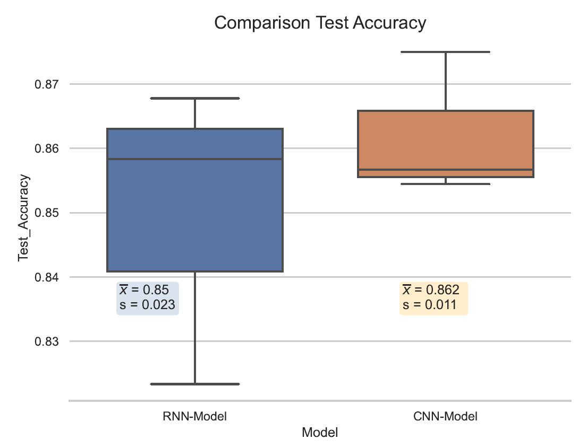

# Nick_Just_Portfolio
Portfolio of Machine Learning Projects by Nick Just

## [Computer Vision Project - R-CNN for object detection and motion tracking](https://nickjust.github.io/RCNN_object_detection/)

### Project overview 
* Applied detection and classification of moving objects (Computer Vision) using self-developed Deep Neural Networks (CNN, R-CNN)
* Self-generated and manually labeled dataset of the individual object to be identified 
* Implementation in Python using Tensorflow, Keras and OpenCV 
* Extension of the algorithm to recognise the object (remote controlled car) both in individual pictures and videos in order to track its movement

  

You can access to it **[HERE](https://nickjust.github.io/RCNN_object_detection/)**

## [Natural Language Processing Project - Automatic Speech Recognition of command words with CNN and RNN-LSTM](https://nickjust.github.io/ASR_command_words/)

### Project overview

* Realized a Automatic Speech Recognition system (ASR/NLP) to classificate command words with custom modeled CNN and RNN-LSTM
* Implementation in Python using the libraries Tensorflow, Keras and Librosa 
* Quantitative comparison and evaluation of both neural networks by 3-fold speaker independent cross validation, average evaluation metric scores (Precision, Recall, F1-Score, Accuracy)  confusion matrix and statistical t-Test analysis
* Achieved a classification accuracy of over 85% on average for both models

  

You can access to it **[HERE](https://nickjust.github.io/ASR_command_words/)**
